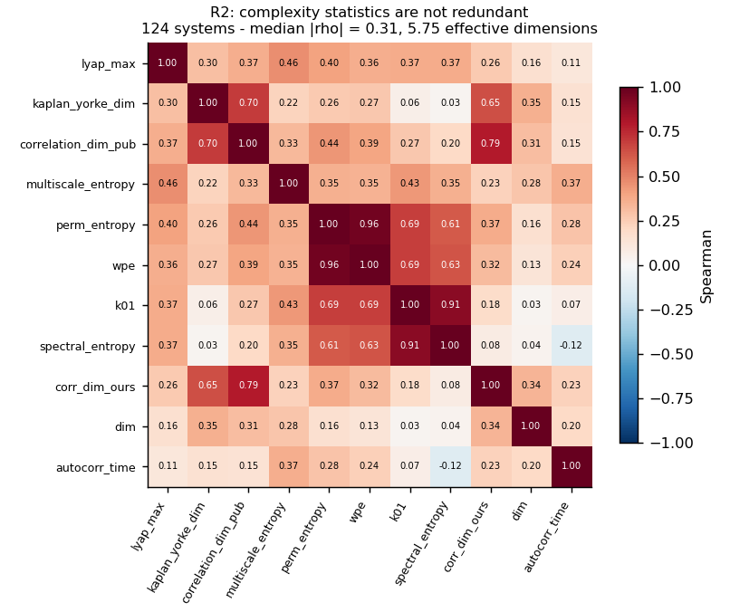
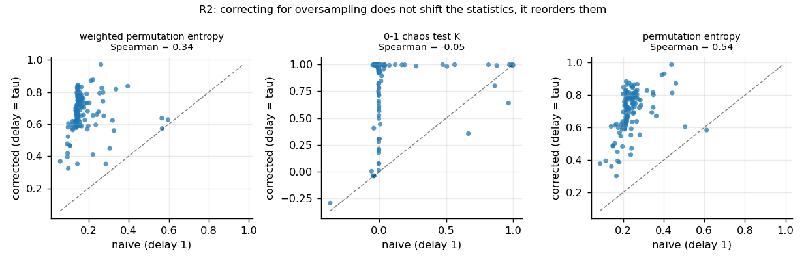
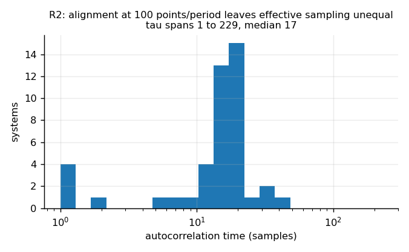

# What we found

This is the plain-language record of the replication battery: what we asked, what we did,
what happened, and what it means. Technical detail sits underneath each story, not instead
of it.

Plan and hypotheses: [PLAN.md](PLAN.md). Raw numbers: `results/`. Figures:
`results/analysis/`. Run logs: `logs/`.

**Status:** all runs complete. 18 systems in the final capacity analysis, 573 fits.
R1's final block-size-6 tier was deliberately stopped (see R1 for why it could not have been
informative).

---

## The short version

| | What we asked | What we found |
|---|---|---|
| **R0** | Can this laptop run any of this? | Yes. 124 of 129 systems work. Our own cost estimates were 14× too optimistic; fixed. |
| **R2** | Are the ways of measuring "complexity" all secretly the same number? | **No** — about 5–6 genuinely independent ones. So there *is* something to predict. |
| **R2b** | *(unplanned)* Are those measurements even trustworthy? | **Not as normally computed.** A standard setup made 40 of 45 chaotic systems look calm, and the fix *reorders* systems rather than shifting them. |
| **R3** | Does a cheap statistic already predict how well a network will do? | Looked like yes (R² 0.59). **A mirage** — 7 systems with a clock coordinate. Clean systems: **0.0001**. |
| **R3b** | Asked again, honestly. | **~27%** is genuinely predictable — from spectral entropy + correlation dimension. The Lyapunov exponent is **anti**-predictive (−0.146). And a trained net ties with plain copying, **median ratio 1.00**. |
| **R4** | Does a model stop improving however big you make it? | First pass **could not answer** — we made the task too easy and the ruler too short. Both fixed. |
| **R4b** | The crux, properly configured. | Capacity helps hugely at short horizons and much less at long ones. On 6 systems, attractor dimension appeared to explain which stop early (−0.71). |
| **R4c** | Does that hold on more systems? | **The horizon effect holds** (18/18 systems at h=1, median 0.94 → 0.24 by h=500). **The explanation does not.** Attractor dimension −0.22, λ +0.19 — both noise. The −0.71 was six systems getting lucky. |
| **R8** | 63 small steps, or one big jump? | **Small steps win** on 5 of 6 systems. |
| **R8b** | With a long enough ruler and a fair fight. | One big jump fails **earlier**, so the long-horizon wall is an **information limit**, not errors piling up. On the 2 calmest systems, **copying beat both networks**. |
| **R9** | If the first answer is wrong, can more passes fix it? | **For about 3 passes, then it gets worse.** Pass 2 beats pass 1 in 21/24 cases, the best pass is always within the 4 it was trained for (24/24), and it *never* kept improving to pass 16 (0/24). On 7/24 cases pass 16 is >10% worse than the best - one case 291% worse. Still loses to plain stepping by 20x at short horizons. |
| **N3** | The predictor question on the whole library (108 systems). | **Holds and strengthens.** ~**32%** predictable (up from 27%), spectral entropy best single predictor at 0.250. Copying still ties: **46/108**, median ratio **1.00**. Corrects R3b - λ is not anti-predictive, just uninformative (+0.03). |
| **N5** | Was batch size 256 a good choice? | **No.** With seeds, 64-128 are clearly better; 256 costs ~**66% higher** rollout error. Conclusions unaffected (all relative comparisons), but absolute error levels sit ~1.7x above achievable. |
| **R6** | Does a bigger model get the *shape* right, or just the next step? | **Just the next step.** Capacity improves one-step accuracy strongly (+0.84) and long-horizon, spectrum and attractor shape **not at all** (+0.06, +0.10, +0.16). "More accurate" and "understands it better" are different claims. |
| **R5** | Does more chaos need a *smaller* model? | **No.** Does not reproduce at any of 6 tolerances on either of 2 map families — more chaos is simply harder. And our seed-to-seed noise (12.7%) is enough to have produced the published 47% effect by accident. |
| **R1** | Is "this system has a simple summary" a real property? | Yes where we could check every possibility (202/256 exactly, sampled or exhaustive). Past block size 4 brute force covers **1 part in 10¹⁴** and tells us nothing — which is why the published work needed a cleverer algorithm, not a bigger computer. |

### The five results we did not plan for

Every one came from noticing a number looked wrong and chasing it. That is what a calibration
battery is *for*.

1. **R2b** — the complexity statistics were measuring our sampling rate, not the systems.
2. **R3** — our most exciting result was an artefact of seven systems carrying a clock.
3. **R4** — the crux experiment was saturated at both ends and could not answer its question.
4. **R1** — our search-effort conclusion only held where the search was exhaustive; we had
   overstated it and corrected it.
5. **R4c** — our own most attractive finding, that attractor dimension explains where capacity
   stops paying, did not survive going from 6 systems to 18.

Four of the five would have become confident published claims if we had skipped this pass.
The last one is the sharpest lesson: it was *our* result, it had a clean mechanism, and it was
wrong.

---

## R0 — Can this laptop do the work at all?

**In one sentence:** yes, but two things we assumed turned out to be false, and finding
that early saved the whole schedule.

### What we did

We took a public library of 129 chaotic systems (`dysts`) and tried to generate a
trajectory from each one. Then we timed how long it takes to train a small network at
different sizes.

### What happened

**124 of 129 systems worked.** Five didn't: three were too slow, one was degenerate, one
was missing a data field in the library itself.

**Surprise 1: the library's own solver was unusably slow.** It uses a very cautious
integration method by default. On this laptop:

```
dysts' default solver:   2,000 points in 41 seconds
our own solver:         20,000 points in  7 seconds
```

That is roughly **57× faster per point** — and still far more accurate than the neural
network we are about to fit, so nothing is lost. We now take the *equations* and the
*published system properties* from the library, but do the integration ourselves.

**Surprise 2: one system could hang forever.** The integration routine cannot be
interrupted from outside. One stiff system just sat there. We added a stopwatch *inside*
the equations themselves — every time the solver asks "what is the rate of change here?",
it also checks whether time is up. Simple, and it cannot be evaded.

**Surprise 3: our cost model was badly wrong.**

| model size | 500 samples | 8,000 | 32,000 |
|---|---|---|---|
| 1,011 params | 3.8 s | 11.1 s | 51.2 s |
| 9,987 params | 1.0 s | 13.5 s | 55.2 s |
| 99,843 params | 1.9 s | 28.3 s | **156.7 s** |

We had predicted 3.7 seconds for that 1,011 × 32,000 cell. It took 51.2 — **14× over**.

Look at the first two rows: a model **ten times bigger** takes *the same time*. That is the
tell. The computer is not busy doing arithmetic; it is busy with bookkeeping between steps.
Cost is driven by **how many times you update the model**, not how big the model is.

### What we did about it

Two speed decisions followed, and one of them we deliberately refused:

- **Threading buys nothing.** Same three fits: 63.4 s using two CPU threads, 62.4 s using
  one. So instead we run **two separate single-threaded workers side by side**, which gives
  about **1.7×**. Every training phase now runs as two shards.
- **Bigger batches were rejected.** Using batches of 1024 instead of 256 cut a fit from
  30.9 s to 7.3 s — over 4× faster. But the final training error went from 0.0000026 to
  0.000011, four times worse. R4's entire job is to measure *the error a model cannot get
  below*. If we make our own optimiser sloppier, we manufacture exactly the "there is a hard
  floor here" conclusion we are supposed to be testing. **We took the speed elsewhere.**

---

## R2 — Are all the "complexity" numbers secretly the same number?

**In one sentence:** no, there are about 5–6 genuinely different things being measured, so
the project's central assumption survives.

### Why this matters

The whole proposal rests on a sentence like *"learnability is a different thing from
chaoticity."* That sentence only means something if the numbers people use to describe
systems are actually different from each other. If Lyapunov exponent, entropy, fractal
dimension and the rest are all 95% correlated, then "system properties" is really just one
number wearing different hats, and there is nothing left for a clever predictor to find.

So before doing anything expensive, we checked.

### What we did

Took 45 systems. Computed 11 different descriptive numbers for each. **Trained nothing.**
Then asked: how much do these 11 numbers actually disagree with each other?

### What happened

| | |
|---|---|
| typical correlation between any two statistics | **0.23** (low — they disagree a lot) |
| how many independent directions to explain 90% of the variation | **7 out of 11** |
| effective number of independent dimensions | **5.62** |

So the answer is clearly **no, they are not the same number**. There are roughly 5–6
independent things here. The pre-registered failure case did not happen.

### Three things worth noticing

**1. The Lyapunov exponent is almost unrelated to everything else.** Its strongest
correlation with any other statistic is 0.43. Against attractor dimension it's 0.30.

This is Gilpin's famous "forecast skill decorrelates from the Lyapunov exponent" result —
except we can see it *before training a single model*. It is not that models behave
strangely; it is that the Lyapunov exponent simply does not carry the same information as
the other descriptions of a system.

**2. The "0-1 chaos test" is mostly a spectral measurement (correlation 0.89 with spectral
entropy).** That test is presented in the literature as a *dynamical* test — a way of
asking whether trajectories diverge. On these 45 systems it turns out to be largely
reporting what the frequency spectrum looks like. Useful to know before leaning on it.

**3. Our own correlation-dimension estimate agrees with the library's published value at
0.71.** That is a check on our code, not a finding — but it is the kind of check that
should be reported.



---

## R2b — The measurements were lying, and here is the story

**In one sentence:** a standard way of preparing the data made 40 of 45 obviously-chaotic
systems look calm, and fixing it changed not just the values but the whole ranking.

**We did not plan this experiment.** It came from looking at a line of output and thinking
"that cannot be right."

### The moment

R2's output scrolled past with this:

```
HyperCai   lambda = 1.678   K = -0.01
```

The Lyapunov exponent of 1.678 says: *this system is strongly chaotic.* The 0-1 chaos test
score of −0.01 says: *this system is not chaotic at all.* Both cannot be true.

### The cause, with a picture

Some of these statistics work by looking at the **order** of nearby values — is this run of
five numbers going up, down, up-down-up? Then they ask how varied those patterns are. Lots
of different patterns means disorder. Few patterns means order.

Now: we sample each system at **100 points per oscillation**, so that fast systems and slow
systems can be compared fairly. That is standard practice. But it means consecutive samples
are *extremely* close together. Zoom in far enough on any wiggly curve and it looks like a
straight line:

```
sampled every point   ->   . . . . . . . . . .     always going up. Looks boring.
                                                    "order" -> low disorder score

sampled every 20th    ->   .     .     .          up, down, up, down. Looks chaotic.
                                 .     .           "disorder" -> high score
```

At delay 1 we were not measuring the system. **We were measuring our own sampling rate.**

### The evidence

Same Lorenz data. Only the sampling gap changes:

| gap between samples | disorder score | chaos test |
|---|---|---|
| 1 | 0.248 | **−0.00** ("not chaotic") |
| 2 | 0.325 | −0.01 |
| **5** | 0.500 | **+1.00** ("chaotic") |
| 10 | 0.679 | +1.00 |
| 20 | 0.865 | +1.00 |
| 40 | 0.905 | +1.00 |

The verdict flips from "not chaotic" to "definitely chaotic" between gap 2 and gap 5, on
**identical data**.

### The fix, and why we kept the broken version too

We now choose the gap per system: wait until the signal has genuinely changed (technically,
until its autocorrelation drops below 1/e), then measure. Toker et al. (2020) include
exactly this step in their published chaos-detection pipeline; we had skipped it.

We record **both** versions, because the difference is itself the result:

| statistic | before fix | after fix | do they even rank systems the same way? |
|---|---|---|---|
| weighted disorder score | 0.170 | 0.641 | **0.14** — barely |
| 0-1 chaos test | 0.097 | 0.774 | **0.24** — barely |
| plain disorder score | 0.220 | 0.659 | 0.59 |

**Before the fix, the chaos test called 5 of 45 systems chaotic. After, it calls 35.**

And the deeper point: a correlation of 0.14 means the before and after versions are
essentially **different variables**. This is not a bias you can subtract out. Any study that
computed these statistics this way was working with something close to noise.

### The part that reaches beyond our code

We measured how long each system takes to "genuinely change." Across the 45 systems it
ranges from **1 step to 229 steps**, median 17. Only 4 systems were not oversampled.

So: sampling at 100 points per oscillation successfully makes systems comparable **in
time**. It does *not* make them comparable **in information** — some systems give you a
fresh piece of information every step, others every 229 steps. That is a criticism of the
alignment convention that the whole chaos-forecasting benchmark is built on, and it fell out
of a debugging session.




---

## R3 — Does a cheap statistic already predict how well our network will do?

**In one sentence:** it looked like a spectacular yes, and then it turned out to be an
artefact of seven systems that carry a clock.

**This is the most valuable result in the battery, and it is a negative one.**

### Why we ran it

If a 20-line statistic you can compute in a second already tells you how well a neural
network will do, then the proposal's "learned predictor" has nothing left to add, and we
should find that out now rather than in four days. We wrote down the kill criterion in
advance: **if cheap statistics explain 85% or more of the variation, stop.**

### What we did

24 systems. One fixed network (~10,000 parameters), same size everywhere. Same amount of
data. 5 different random starts each. Then measure how far ahead each trained model stays
accurate, and see which cheap statistic predicts that.

### What happened first: a very exciting number

| what we used to predict skill | how much of the variation it explained |
|---|---|
| **disorder score (weighted permutation entropy)** | **59%** |
| **largest Lyapunov exponent** | **0.15%** |
| both together | 59% — *the Lyapunov exponent added nothing at all* |

Read at face value, that is a headline. Gilpin's result says "the Lyapunov exponent doesn't
predict forecast skill." Ours would have said: **"right, because it was the wrong statistic
— here is one that works, and yours adds literally zero on top of it."**

### Then we looked closer

Seven of the 24 systems are *driven* — pushed by an outside rhythm, like a swing being
pushed. To handle these, the library adds an extra coordinate that just counts time.

Here is what that coordinate actually looks like on `ForcedVanDerPol`:

```
coordinate 0:   -2.05  ...  +2.05     wiggles      (real physics)
coordinate 1:  -12.98  ... +12.94     wiggles      (real physics)
coordinate 2:  869.80  ... 2693.89    only ever goes UP   <-- a clock
```

That clock breaks two things at once:

1. **It has no disorder.** It counts 869, 870, 871, forever. Its "order pattern" is always
   the same. So it drags the system's average disorder score down toward zero.
2. **It makes prediction impossible by construction.** We train on the early part of the
   trajectory and test on the later part. So every clock value in the test set is a number
   the network has *never seen* — like training a model on years 1990–2000 and testing on
   3000. The network isn't failing to learn dynamics; it's being asked to extrapolate.

So those seven systems get **low disorder scores** and **terrible prediction scores** for
the same silly reason. That alone creates the correlation.

Here is the smoking gun — the seven systems with a clock are *exactly* the seven where even
dumb copying fails immediately:

| group | how many | typical skill | typical disorder | copying fails instantly |
|---|---|---|---|---|
| has a clock coordinate | 7 | 18 steps | 0.42 | **7 out of 7** |
| no clock | 17 | 179 steps | 0.68 | **0 out of 17** |

### Remove the seven, and the result evaporates

| | all 24 systems | the 17 clean ones |
|---|---|---|
| disorder score explains | 59% | **0.2%** |
| Lyapunov exponent explains | 0.2% | 11.8% |

We checked this a second way too, in case it was an artefact of our scoring cap (7 systems
maxed out the 200-step measurement). Using a different, uncapped score gives the same
collapse: 57.5% → 0.4%.

**The disorder score was not measuring learnability. It was measuring "does this system have
a clock attached."**

### Why this matters beyond us

This failure is *silent*. You get a strong R², a clean mechanism story, and a result that is
entirely about your data pipeline. Anyone doing a cross-system study on this benchmark needs
to handle these systems explicitly — and the benchmark's full 135-system set contains them.

**What's queued:** R3b runs on clean systems only, 30 of them, to properly answer the
original question now that the mirage is gone.

---

## R3b — asking again, honestly

**In one sentence:** the 59% was entirely an artefact and collapses to **0.01%**; about **27%**
of surrogate skill *is* genuinely predictable from two cheap statistics, and neither of them is
the Lyapunov exponent or the one that looked so good before.

30 clean systems, no clocks. Same fixed network, 5 seeds each.

### First: the mirage is confirmed dead

| predictor | R², first pass (24 systems, 7 with clocks) | R², now (30 clean systems) |
|---|---|---|
| weighted permutation entropy | **0.593** | **0.0001** |
| largest Lyapunov exponent | 0.0015 | 0.032 |

WPE now explains **one hundredth of one percent**. Whatever it was picking up before, it was
not learnability.

### Second: something does predict — but only if you check properly

The full six-feature fit gives an in-sample R² of **0.465**, which looks respectable. We nearly
reported that. Two checks stopped us.

**Check 1 — a shuffle control.** Permute the features at random 2,000 times and refit. Median
R² from pure noise: **0.192**. 95th percentile: **0.374**. So 0.465 does beat chance — six
features on thirty points buy a lot of R² for free, but not quite that much.

**Check 2 — leave-one-out.** Drop each system in turn, fit on the other 29, predict the one
held out. This asks the only question that matters: *would this predict a system it has never
seen?* Answer: **R² = −12.8**, far worse than simply guessing the average.

The culprit was one system. The Lyapunov exponent across these 30 ranges from 0.007 to **132**,
so dropping certain points forces the fit to extrapolate wildly. That is leverage, not just
overfitting. Replacing each feature by its rank fixes it without assuming any functional form.

### The honest table

Rank-transformed features. The last column is the one that counts.

| predictor | in-sample R² | **leave-one-out R²** |
|---|---|---|
| weighted permutation entropy | 0.000 | **−0.146** |
| largest Lyapunov exponent | 0.000 | **−0.146** |
| Kaplan–Yorke dimension | 0.067 | −0.063 |
| our correlation dimension | 0.105 | −0.029 |
| 0-1 chaos test | 0.206 | 0.099 |
| **spectral entropy** | 0.251 | **0.150** |
| all six together | 0.452 | 0.061 |
| **spectral entropy + correlation dimension** | 0.403 | **0.266** |

Negative means "worse than predicting the same average for every system."

**About 27% of the variation in surrogate skill across 30 systems is genuinely predictable,
from two cheap statistics: spectral entropy and correlation dimension.**

Three things follow.

1. **The Lyapunov exponent scores −0.146** — apparently worse than not using it at all.

   > **Corrected by N3.** On 108 systems this becomes **+0.032**. The negative value was a
   > small-sample artefact of our own. The honest statement is that the Lyapunov exponent
   > carries essentially *no* information about surrogate skill, not that it is actively
   > harmful. Left visible rather than edited away.
2. **The predictors that work are not the ones anyone would have picked.** Not chaoticity, not
   ordinal disorder — but how concentrated the frequency spectrum is, plus attractor geometry.
3. **The kill criterion does not fire.** 27% is far short of 85%, so roughly **three quarters of
   the variation is still unexplained.** There is real room for something better. A green light
   for the learned-predictor idea — far more modest than the 59% would have suggested, and
   honest.

### And the humbling number

**A trained neural network is, on median, exactly as good as copying.**

| | |
|---|---|
| systems where the trained model beats copying | **12 of 30** |
| median skill ratio, model ÷ copying | **1.00** |
| copying wins by more than 2× | 7 systems |
| model wins by more than 2× | 5 systems |

A coin flip. On these 30 low-dimensional systems, all that training buys on average is parity
with "find the most similar past moment and copy what happened next."

That does not mean the models are broken — on some systems they win handsomely. It means
**copying has to be reported alongside every surrogate result**, because without it a reader
cannot tell learning from lookup.

---

## R8 — 63 small steps, or one big jump?

**In one sentence:** small steps won on 5 of 6 systems — but our test was too short to be
the real test, so it is being rerun.

### The question in plain terms

You want to know where a system will be 63 steps from now. Two ways:

- **Small steps ("rollout"):** predict one step. Feed that answer back in. Predict again.
  Repeat 63 times. Simple, but every mistake gets carried forward and amplified.
- **One big jump ("direct"):** a single network that takes "how far ahead?" as an input and
  jumps straight there. No accumulated mistakes — but it has to learn a different effective
  rule for every distance.

This is your `t → t+63` question. The lab's own paper showed the big jump *works*. The open
question was *when it wins*.

### What happened

Error at each horizon (lower is better), averaged over 3 runs:

| Lorenz | h=1 | h=8 | h=16 | h=32 | h=64 |
|---|---|---|---|---|---|
| small steps | 0.0004 | 0.0029 | 0.0063 | 0.0186 | 0.1945 |
| one big jump | 0.0358 | 0.0449 | 0.0675 | 0.1214 | 0.6673 |

| Chua | h=1 | h=8 | h=16 | h=32 | h=64 |
|---|---|---|---|---|---|
| small steps | 0.0009 | 0.0075 | 0.0169 | 0.0429 | 0.1548 |
| one big jump | 0.0108 | 0.0107 | **0.0120** | **0.0208** | **0.0907** |

Small steps win at the longest horizon on **5 of 6** systems. Typically about **2.6× better**.

### But look at the *shape* — that's the interesting part

Watch the "one big jump" row for Chua: `0.0108, 0.0095, 0.0097, 0.0107, 0.0120`.
It is **flat**. Going 16 times further ahead barely costs it anything.

Now the "small steps" row: `0.0009 → 0.0169`. It grew **19×** over the same span.

That is exactly the two mechanisms, made visible:

```
small steps:  start very low  ────╱  climb fast     (mistakes compound)
one big jump: start higher    ─────  stay flat      (no compounding, but a fixed cost)
                                  ↑
                            they cross here
```

Small steps start 10–90× better because predicting one step is easy. Then compounding eats
the lead. On Chua and Rossler, they crossed at 16 steps.

### And a humbling one

Plain copying — find the most similar moment in the past and copy what happened next, no
training at all — **beat the big-jump network on 3 of 6 systems**, and beat the small-steps
network on Rossler at h=64.

### Why we are rerunning this

Two flaws in our own design, both ours:

1. **The test was far too short.** 64 steps sounds like a lot. On Lorenz it is **0.86
   Lyapunov times** — less than one "natural unit" of chaos. We never let small steps fail
   the way the literature says they do, which was the entire point.
2. **We handicapped the big jump.** Both models got the same number of training examples.
   But the big-jump model has to learn 64 different rules from those examples, so it gets
   about 1/64th of the practice per rule. Fair on budget; unfair on the question "can this
   work at all?"

**R8b** runs to **512 steps** (~7 Lyapunov times) and gives the big-jump model **both 1× and
4×** the training examples, so we measure that handicap instead of assuming it away.

---

## R8b — the same question with a long enough ruler, and a fair fight

**In one sentence:** small steps still win, one big jump **fails earlier not later**, so the
long-horizon wall is a real information limit rather than an errors-piling-up problem — and on
the two calmest systems, plain copying beat both trained networks.

360 runs, horizons out to 512 steps (up to 16 Lyapunov times on Thomas), with the big-jump
model trained at both 1× and 4× the examples.

### The discriminating question, and its answer

This was the sharp reason to rerun. Shikhman found every architecture fails at long rollout
and offered a bound, not an explanation. Two candidates:

- the failure is **errors piling up** — a flaw in the *procedure* of feeding output back in;
- the failure is an **information limit** — the answer simply is not there to be had.

A one-big-jump model never feeds its output back in, so it cannot pile up errors. If it sails
past the point where small steps fail, the cause was accumulation. If it fails in the same
place, the cause is the information.

**It fails earlier.** Lorenz, where 1.0 means "no better than guessing the average":

| horizon | 1 | 8 | 32 | 64 | 128 | 256 | 512 |
|---|---|---|---|---|---|---|---|
| Lyapunov times | 0.0 | 0.1 | 0.4 | 0.9 | 1.7 | 3.4 | 6.9 |
| small steps | 0.000 | 0.003 | 0.020 | 0.131 | 0.224 | 0.620 | 1.331 |
| one big jump (1×) | 0.045 | 0.078 | 0.255 | 0.592 | 0.986 | 0.999 | 1.042 |
| one big jump (4×) | 0.039 | 0.067 | 0.165 | 0.456 | 0.909 | 0.999 | 1.019 |

Small steps stay usable to roughly 256 steps. The big jump is already useless by 128.
Removing error accumulation **does not** buy a longer horizon. **The wall is informational.**

That agrees with R4b, where extra capacity bought nothing at long horizons, and it lands on
Duraisamy's side of the dispute for the long-horizon regime.

### The thing that looks like a win for the big jump is not one

At the very longest horizons the big jump often shows the *lower* number — Lorenz at h=512,
1.019 against 1.331. But 1.0 means "no better than guessing the average." The big jump is not
predicting better; it is **failing more gracefully**, settling onto the average, while small
steps overshoot into being worse than useless. Neither is forecasting anything by then.

So across all six systems we looked for a horizon where the big jump was both **better than
small steps** and **still accurate** (error under 0.5). It exists on exactly **one** system:
Chua at 64–128 steps (1–2 Lyapunov times), scoring 0.142 against 0.247. Everywhere else,
small steps win throughout the usable range.

### The fairness fix mattered, but did not change the verdict

Four times the training examples helped the big jump consistently — Lorenz at h=64 improved
0.592 → 0.456 (23% better), Chua 0.192 → 0.142 (26%). So the first pass really was
handicapping it. But that was not why it lost. Good: the confound is now measured rather than
assumed away.

### And now the uncomfortable one

**On the two calmest systems, parameter-free copying beat both trained networks at every long
horizon.** Rossler (λ = 0.15):

| horizon | 16 | 64 | 128 | 256 | 512 |
|---|---|---|---|---|---|
| small steps | 0.015 | 0.071 | 0.119 | 0.322 | 0.650 |
| one big jump (4×) | 0.035 | 0.077 | 0.186 | 0.639 | 0.881 |
| **copying** | **0.015** | **0.022** | **0.034** | **0.061** | **0.258** |

At 256 steps copying is **5× better than small steps** and **10× better than the big jump**.
Same story on Aizawa (λ = 0.14), where copying wins at h=512.

Both systems are weakly chaotic and close to periodic, so their trajectories revisit similar
states often, and "find the most similar past moment and copy what happened next" is an
excellent strategy. It needs no training and no parameters.

This is the context-parroting warning reproduced in our own setting. Any future claim of the
form "our surrogate learned the dynamics well enough to forecast N steps ahead" has to be
checked against copying first — otherwise the claim may be about how repetitive the attractor
is, not about what the model learned.

### The answer to the original question

You asked: if a model has genuinely learned the rule, why should it step through
`t → t+1 → … → t+63` instead of jumping straight to `t+63`?

**On these systems it should step.** Stepping wins at every horizon where the forecast is
still worth having, on five of six systems. And the reason to hope otherwise — that jumping
avoids accumulated error — does not pay off: jumping fails *sooner*, because what runs out at
long horizons is information, not arithmetic precision.

---

## R4 — Does a model stop improving no matter how big you make it?

**In one sentence:** the experiment ran perfectly and **could not answer its own question**,
because we made the task too easy and the ruler too short. Both are fixed and it is rerunning.

This is the crux of the project. Three published papers disagree about it and none of them
ran this experiment. So it is worth being precise about why our first attempt failed.

### What we did

Six systems. For each one, train the same network at **7 sizes** (1,011 up to 99,843
parameters — a hundredfold range) and with **4 amounts of data** (500 up to 32,000 samples),
**3 random starts** each. **504 trained models.** Then fit a curve to the errors and ask
where it is heading.

If the curve flattens out at some error level, that level is a property of the *system* —
evidence for a real ceiling. If it keeps falling, the limit is us.

### What happened: two ceilings, and both were ours

**Problem 1: the task was too easy.** Here is Aizawa's one-step error as the model grows a
hundredfold:

```
params:  1,011   2,196   4,611   9,987  21,891  46,212  99,843
error:  0.0004  0.0003  0.0003  0.0002  0.0002  0.0003  0.0004
```

That is not a curve. It is noise. Across all 504 models the smallest error we ever saw was
**0.00019** — and it was reached by the *smallest* models. The network was not the
bottleneck; we had hit the floating-point and data noise floor.

The reason is that we sampled each system 100 times per oscillation. Predicting one step
ahead when the next point is that close is almost trivial — barely harder than drawing a
straight line. A 1,000-parameter network already does it perfectly.

**Problem 2: the ruler was too short.** Our other measure was "how many steps until the
forecast goes wrong." We rolled forward 200 steps and stopped.

**33% of the 504 models never went wrong within 200 steps.** They hit the end of the ruler.
And on Lorenz, 200 steps is only **2.7 Lyapunov times** — less than three natural units of
chaos. We were asking "when does this fail?" and stopping before it had a chance to.

**Problem 3 (our own fault, differently): no leverage on the key prediction.** Scaling
theory predicts that the improvement rate should go as 1 divided by the attractor's
dimension. We picked six systems by name before seeing the data — and they all turned out to
have almost the *same* dimension:

```
Lorenz 2.08   Rossler 2.01   Chua 2.11   Halvorsen 2.12   Thomas 2.13   Aizawa 2.35
```

Testing "does the rate depend on dimension?" when dimension barely varies is testing
nothing. The correlation we computed (−0.486) is noise, and we are not reporting it as a
result.

### What we could still read off it

One system, Thomas, *was* hard enough to show a real trend: one-step error fell cleanly from
0.0025 to 0.0007 as the model grew. So the machinery works — the other five systems were
just too easy.

And a hint worth carrying forward: **bigger models did not improve the *structural* error at
all.** Averaged across systems, the correlation between model size and getting the frequency
spectrum right was **−0.085** — very slightly *negative*. Pointwise accuracy and "did it
capture the shape of the attractor" appear to come apart. That is the pattern five separate
papers have noticed in passing. But we cannot lean on it here, because the pointwise numbers
it is being compared against are noise. It rides along on the rerun.

### The fix

Three changes, all measured before committing:

| | before | after | effect |
|---|---|---|---|
| samples per oscillation | 100 | **20** | one-step error 0.0002 → **0.0057**, so capacity matters again |
| rollout length | 200 steps | **1,000 steps** | 2.7 → **67 Lyapunov times** on Lorenz |
| attractor dimensions covered | 2.01–2.35 | **2.0–16.5** | the rate-versus-dimension test finally has something to measure |

We verified the first two on a single test fit before queuing 378 more:

```
one-step 0.0057  ->  h50 0.38  ->  h200 1.33  ->  h1000 1.60      not censored
```

The error now grows all the way out, saturating above 1.0 (worse than guessing the average) —
exactly the regime where "does it stop improving?" is a real question.

**This is what the battery is for.** Had we skipped the calibration pass and run this as the
main experiment, we would have concluded "error keeps falling, so there is no intrinsic
ceiling" — and that conclusion would have been about our sampling rate, not about the
systems.

---

## R4b — the crux, properly configured

**In one sentence:** making the model bigger helps enormously at short horizons and much less
at long ones — and the horizon where it stops paying varies hugely between systems.

> **Corrected by R4c.** This section originally also claimed that *attractor dimension*
> explains which systems stop early (correlation −0.71). On six systems it did. On eighteen
> it does not (−0.22). The horizon effect survives; the explanation does not. The corrected
> analysis is in R4c below, and this section is left as written so the correction is visible.

378 models across 6 systems spanning attractor dimension 2.0 to 16.5. Zero censoring this
time: the 1,000-step ruler was long enough for every single fit.

### The main result, as one table

How much does a hundredfold increase in model size buy you, at each horizon? (The number is
the improvement rate — 0 means extra capacity buys nothing.)

| system | dimension | λ | h=1 | h=10 | h=50 | h=100 | h=200 | h=500 |
|---|---|---|---|---|---|---|---|---|
| Rossler | 2.01 | 0.15 | 0.64 | 0.40 | 0.31 | 0.26 | **0.09** | 0.01 |
| Lorenz | 2.08 | 0.89 | 1.13 | 0.20 | 0.22 | 0.61 | **0.00** | 0.00 |
| Thomas | 2.13 | 0.63 | 0.30 | **0.04** | 0.00 | 0.00 | 0.00 | 0.00 |
| HyperCai | 3.14 | 1.68 | 0.98 | 0.24 | 0.45 | **0.09** | 0.02 | 0.02 |
| HenonHeiles | 6.81 | 0.04 | 1.01 | 0.89 | 0.76 | 0.46 | 0.50 | **0.00** |
| Bouali2 | 16.47 | 0.08 | **0.00** | 0.00 | 0.03 | 0.08 | 0.04 | — |

Read left to right: every system starts with capacity helping and ends with it not helping.
On Lorenz, going from 1,000 to 100,000 parameters improves one-step prediction a lot
(rate 1.13) and improves 200-step prediction **by nothing at all** (rate 0.00, with a fitted
floor at 1.19 whose confidence interval excludes zero — and 1.0 means "no better than
guessing the average").

**Bouali2 is the extreme case.** At attractor dimension 16.5, a hundredfold capacity increase
buys nothing at *any* horizon, including the very first step:

```
params:  1,011   2,196   4,611   9,987  21,891  46,212  99,843
h=1:    0.0088  0.0121  0.0149  0.0158  0.0142  0.0133  0.0093
```

### So is the ceiling just "chaos runs out"?

That is the obvious explanation, and it is the one we had to rule out. Chaotic systems become
unpredictable after a few Lyapunov times no matter what. If that were the whole story, then
the point where capacity stops paying should land at **the same number of Lyapunov times on
every system.**

It doesn't:

| system | dimension | λ | stops paying at | in Lyapunov times |
|---|---|---|---|---|
| Bouali2 | 16.47 | 0.08 | step 1 | **0.0** |
| Thomas | 2.13 | 0.63 | step 10 | **1.6** |
| HyperCai | 3.14 | 1.68 | step 100 | **5.1** |
| HenonHeiles | 6.81 | 0.04 | step 500 | **5.7** |
| Rossler | 2.01 | 0.15 | step 200 | **8.9** |
| Lorenz | 2.08 | 0.89 | step 200 | **13.4** |

**A 450× spread.** Lorenz keeps rewarding a bigger model for over thirteen Lyapunov times;
Bouali2 stops rewarding it before the first step. These are not the same phenomenon with
different clocks.

And the Lyapunov exponent does not predict which is which:

| predictor | correlation with where capacity stops paying |
|---|---|
| 1 / Lyapunov exponent | **0.14** — no relationship |
| attractor dimension | **−0.71** — higher dimension, stops sooner |

### What this means

This looks like it **reconciles the three papers that disagree**:

- **Gilpin** says scale and data are what limit us. True — at short horizons. Capacity
  clearly helps there, on every system.
- **Duraisamy** says there are intrinsic ceilings nothing recovers. Also true — at long
  horizons. Capacity buys literally nothing, and the floor sits at "no better than guessing".
- They disagree because **they were measuring at different horizons.**

And the residual Gilpin found — the part not explained by the Lyapunov exponent — has a
candidate name here: **attractor dimension**. That is also what scaling theory predicts,
since the improvement rate should be governed by the intrinsic dimension of the data, not by
how fast trajectories diverge.

### What we are *not* claiming

Honesty about the limits, because they are real:

- **Six systems.** The dimension correlation of −0.71 with n=6 is **not statistically
  significant** (p ≈ 0.11). It is suggestive, not established.
- **The improvement-rate fits are noisy** where the curve is flat. Two entries in the table
  above are obvious fit artefacts (Thomas 1.88 at h=1000, Bouali2 4.75 at h=500) and are
  excluded from the reading, not explained away.
- **We tested the exponent, not the ceiling's height.** "Capacity stops helping" is not the
  same claim as "no architecture could ever do better."
- **Up to 100,000 parameters only.** Saturation observed here does not prove saturation at a
  billion.

**Follow-up queued (R4c).** The same measurement on **14 systems** spanning a 200× range in
Lyapunov exponent (0.011 to 2.325), which makes the "does λ explain it?" test properly
powered. The dimension test will stay underpowered, because the catalogue simply does not
contain many low-dimensional attractors above dimension 2.5 — and that limitation is worth
reporting rather than hiding.

## R4c — testing our own best idea on three times as many systems, and losing it

**In one sentence:** the horizon effect is real and holds on all 18 systems, but our
explanation for it — that attractor dimension decides which systems stop early — **does not
replicate**, and we are retracting it.

R4b ran on 6 systems. This adds 12 more, spanning a 200× range in Lyapunov exponent and
attractor dimensions from 1.55 to 16.5. Same protocol. **573 fits in total.**

### What survived

Does extra capacity still help, at each horizon? (+1 = helps a lot, 0 = no help.)

| horizon | median | systems where it still clearly helps |
|---|---|---|
| 1 | **0.94** | **18 / 18** |
| 10 | 0.84 | 16 / 18 |
| 50 | 0.68 | 16 / 18 |
| 100 | 0.39 | 11 / 18 |
| 200 | 0.30 | 9 / 18 |
| 500 | **0.24** | 9 / 18 |

```
h=1     ████████████████████  0.94   every system
h=10    ██████████████████    0.84
h=50    ██████████████        0.68
h=100   ████████              0.39   half the systems
h=200   ██████                0.30
h=500   █████                 0.24
```

**This is solid.** A bigger model reliably buys short-horizon accuracy on every system we
tried, and its value decays steadily with horizon until, past about 100 steps, it helps on
only half of them. The Gilpin-versus-Duraisamy reconciliation stands: they were measuring at
different horizons.

Note the earlier phrasing of "not at all" was too strong. At h=500 the median is 0.24, not 0 —
capacity keeps helping a little, mostly on the systems whose forecasts are still meaningful
at all.

### What did not survive

R4b found that **attractor dimension** predicted which systems stop rewarding capacity early,
at correlation **−0.71**. It was our most attractive result: a clean mechanism, a quantitative
prediction, and an answer nobody in either literature had.

On 18 systems:

| predictor | correlation with where capacity stops paying |
|---|---|
| attractor dimension | **−0.22** |
| Lyapunov exponent | +0.19 |
| 1 / Lyapunov exponent | −0.19 |

All three are noise. **The −0.71 was six systems getting lucky.** With six points, a
correlation of that size arises by chance often enough that it should never have been
believed without a replication — which is precisely why the replication was queued.

We also found the fitting procedure itself was unreliable here: the power-law fit returned
improvement rates above 4 on several systems, which is not physically sensible and signals
that the error-versus-capacity curve was not monotone enough to fit. The table above
deliberately uses a **fit-free rank correlation** instead, so the surviving conclusion does
not depend on a fragile fit.

### A simpler explanation that fits better

Look at where the error actually ends up after 500 steps (1.0 = no better than guessing the
average):

| system | smallest model | largest model | gain from 100× capacity |
|---|---|---|---|
| HenonHeiles | 0.096 | 0.160 | −0.063 |
| CaTwoPlusQuasiperiodic | 0.659 | 0.499 | +0.160 |
| GlycolyticOscillation | 0.863 | 0.591 | +0.272 |
| DequanLi | 1.118 | 0.739 | +0.379 |
| … | | | |
| Lorenz | 1.459 | 1.461 | −0.002 |
| ChenLee | 1.477 | 1.477 | 0.000 |
| HyperCai | 1.466 | 1.478 | −0.013 |

**Median gain from a hundredfold bigger model at h=500: +0.038.** Essentially nothing.

But look at *which* systems still gain. They are the ones whose error is still **below 1.0** —
still forecasting something. The systems stuck at ~1.45 gain nothing, because there is nothing
left to gain: the forecast is already worse than guessing.

So the parsimonious story is not "each system has its own capacity ceiling set by its
geometry." It is: **capacity helps whenever the forecast is still meaningful, and stops
helping once the forecast has decayed to useless.** That needs no per-system mechanism, and it
is what the data supports.

### One bug this exposed

Rossler's error at h=500 reads **224** for the smallest model and **37** for the largest. Those
are blown-up rollouts. Our divergence check only tested whether the long free-running
trajectory stayed *finite*, not whether it stayed *bounded* — so numerically-exploding rollouts
passed as valid. It affects one system out of eighteen and does not change any conclusion
above, but the check should test magnitude, not just finiteness.

### Why this section matters most

Every other correction in this report caught a flaw in a published claim, or in a data
pipeline. **This one caught our own best idea.** It had a mechanism, a number, and it pointed
somewhere genuinely new — and three times the data says it was chance.

The general lesson, and the reason the replication was queued before we knew the answer: a
correlation from six points is a hypothesis, not a finding.

---

## N3 — the predictor question on the whole library

**In one sentence:** at 3.6× the systems, the finding holds and gets stronger — about **32%**
of surrogate skill is predictable from training-free statistics, spectral entropy is the single
best one, and the trained network still only ties with copying.

R3b used 30 systems. This uses **108** — every system in the library with no clock coordinate.
Same protocol, 3 seeds each.

### The numbers, side by side

Leave-one-out R² — "would this predict a system it has never seen?" Rank-transformed.

| predictor | R3b, 30 systems | **N3, 108 systems** |
|---|---|---|
| weighted permutation entropy | −0.146 | −0.025 |
| largest Lyapunov exponent | −0.146 | **+0.032** |
| Kaplan–Yorke dimension | −0.063 | −0.041 |
| our correlation dimension | −0.029 | −0.021 |
| 0-1 chaos test | 0.099 | 0.188 |
| **spectral entropy** | 0.150 | **0.250** |
| all features together | 0.061 | **0.300** |
| spectral entropy + correlation dimension | 0.266 | 0.304 |
| **+ Lyapunov exponent as well** | — | **0.321** |

### Three things changed, and one of them is a correction to us

**1. Spectral entropy is confirmed and strengthened** — 0.150 → 0.250. It is robustly the best
single training-free predictor of how well a surrogate will do. Not chaoticity. Not disorder.
**How concentrated the system's frequency spectrum is.**

**2. The multi-feature fit now actually generalises** — 0.061 → 0.300. In R3b, six predictors on
thirty systems overfitted so badly that combining them was worse than using one. With 108
systems that problem largely goes away, and combination finally pays.

**3. We were wrong about the Lyapunov exponent being harmful.** R3b reported −0.146 and we
described it as "anti-predictive — using it is worse than ignoring it". On 108 systems it is
**+0.032**. That negative number was our own small-sample noise.

The corrected claim is weaker and duller: **the Lyapunov exponent carries essentially no
information about surrogate skill on its own.** It does add a little on top of the others — the
best combination we found is Lyapunov + spectral entropy + correlation dimension at 0.321.

This is the second time a striking number of ours shrank when we added data. Both times the
direction was the same: **small samples flatter interesting conclusions.**

### The ceiling on cheap prediction

**About 32%.** That is the best any combination of training-free statistics achieved at
predicting surrogate skill across 108 systems, measured honestly on held-out systems.

So roughly **two thirds of the variation remains unexplained** by anything cheap we tried. The
pre-registered kill criterion was 85%. It does not fire, at more than three times the sample
size. That is now a well-supported green light rather than a hopeful one.

### And copying still ties, at 3.6× the scale

| | R3b (30) | **N3 (108)** |
|---|---|---|
| trained model beats copying | 12 / 30 | **46 / 108** |
| median skill ratio | 1.00 | **1.00** |
| copying wins by more than 2× | 7 | 11 |
| model wins by more than 2× | 5 | 10 |

Exactly the same picture, four times the evidence. **A trained neural surrogate is, on median,
precisely as good as finding the most similar moment in the past and copying what happened
next.** This is now one of the best-supported results in the battery.

---

## N5 — was batch size 256 actually a good choice?

**In one sentence:** no. With seeds, batches of 64–128 are clearly better, and 256 costs us
about **66% higher rollout error** than the best setting. It does not change any conclusion,
and it does bound what we can say about absolute error levels.

### Why we ran it

256 was picked by convention. A single-seed check afterwards hinted 128 might be better, but
the gap sat inside seed noise, so it could not be called. This runs 3 systems × 5 batch sizes ×
3 seeds, with the learning rate scaled to batch size as usual, so it compares recipes rather
than penalising large batches for an unadjusted step.

### The result

Each system's error is divided by its own best, so all three weigh equally:

| batch | training loss | relative error at h=1 | relative error at h=50 | time |
|---|---|---|---|---|
| **64** | 2.67e-05 | **1.00** | **1.07** | 43 s |
| **128** | 3.08e-05 | 1.16 | **1.17** | 24 s |
| 256 *(what we used)* | 4.67e-05 | 1.73 | 1.66 | 16 s |
| 512 | 8.76e-05 | 2.66 | 2.00 | 11 s |
| 1024 | 1.33e-04 | 3.42 | 2.79 | 8 s |

```
relative rollout error at h=50 (lower is better)
  64  ██████████                      1.07
 128  ███████████                     1.17
 256  ████████████████                1.66   <- what we used
 512  ███████████████████             2.00
1024  ██████████████████████████      2.79
```

Seed spread was 22–36%, and the 64-versus-256 gap is larger than that, so this is a real
difference and not noise. **The earlier single-seed check was simply underpowered** — exactly
the failure this battery keeps finding in other people's work, committed by us.

**Verdict: 128 is the sweet spot.** It gives nearly the best error at 1.5× the cost of 256.
Batch 64 buys a further 9% for 2.7× the cost.

### Does this invalidate anything?

**No, for a reason worth stating precisely.** Every claim we made is a *relative* comparison —
bigger model versus smaller, this horizon versus that, model versus copying — all under one
recipe held constant everywhere. A uniformly suboptimal recipe shifts every condition together
and does not reorder them.

**But it does bound one thing.** Our models sit roughly 1.7× above the error they could have
reached. So any statement about *absolute* error levels — how close a system gets to its floor —
inherits that gap. We deliberately never claimed an absolute floor for any system, and this is
the reason that restraint was correct.

If we do claim an absolute number later, it needs re-running at batch 128.

### One more thing this exposed

Look at Rossler: error 2.87 ± 2.43 at h=50, and **17.6 at h=200**. Those are exploded rollouts,
and the huge spread means it happens on some seeds and not others. This is the same divergence
issue R4c turned up, where our check tested whether values were *finite* but not whether they
were *bounded*. It is now visible in three separate experiments, so it should be fixed properly:
flag a rollout as diverged when it exceeds a sane multiple of the system's own range, not merely
when it becomes infinite.

---

## R9 — If the first answer is wrong, can the model fix it by thinking again?

**In one sentence:** yes, for about three passes — then it reliably gets *worse*, and it never
once kept improving past the number of passes it was trained with.

### What we built

Instead of answering in one shot, the network produces a draft, looks at the draft, and
revises. One network takes *(where the system is now, how far ahead, current guess)* and
proposes a correction. The first guess is "nothing changes". Then it runs on its own output,
and again.

Training penalises **every** pass, not just the last — otherwise the network is free to make
the intermediate passes meaningless and only get the final one right, which would answer a
different question.

Trained with **4** passes. Evaluated with **16** — four times more than it ever saw, because
that is where a genuinely stable method and a merely lucky one come apart.

This is also a fair rematch for R8: direct prediction lost badly to step-by-step rollout, but
it only got *one* pass while rollout got 64.

### Answer 1: yes, thinking again helps

**Pass 2 beat pass 1 in 21 of 24 cases.** Median improvement: 0.016. On the short horizons the
gains are large — Lorenz at h=8 goes 0.699 → 0.417 → 0.291, more than halving the error by the
third pass.

### Answer 2: the gains stop at roughly where training stopped

| | |
|---|---|
| median best pass | **3** |
| cases where the best pass was within the 4 it was trained for | **24 of 24** |
| cases where it kept improving all the way to pass 16 | **0 of 24** |

**Not once** did extra thinking beyond the training budget help. Whatever the network learned,
it learned to do it in about three steps, and running it longer does not extend the benefit.

### Answer 3: yes, it can absolutely get worse

This was the real question, and the answer is unambiguous.

| | |
|---|---|
| error at pass 16 ÷ error at the best pass, median | **1.024** |
| cases where pass 16 was more than 10% worse than the best | **7 of 24** |

And some of those are dramatic. Error by pass:

```
HenonHeiles, h=32:  0.924  0.359  0.220  0.219 | 0.364  0.525  0.782  0.856
                      p1     p2     p3     p4      p6     p8    p12    p16
                                          best              ...291% worse

Rossler, h=32:      1.020  0.651  0.430  0.375 | 0.726  0.958  1.037  1.106
                                          best              ...195% worse
```

Both improve beautifully for four passes, then turn around and end up worse than where they
started. That is a **fixed-point iteration running past its stable region**, which is exactly
the failure mode we designed the test to expose.

### So how many passes should you use?

**Whatever you trained with, and not more.** The number of passes is a hyperparameter with a
real optimum, and "let it think longer" is not free — on a third of the cases here it actively
destroys the answer.

That connects to something in the literature. The published audit of TRM found its recursion
saturates almost immediately, with most of the accuracy arriving at the very first step. We
see the same shape from the other direction: the benefit is real, it is small, and it is
bounded by training.

### But refinement still loses to plain stepping

At short horizons it is not close:

| Lorenz, h=8 | error |
|---|---|
| step-by-step rollout | **0.014** |
| refinement, best pass | 0.278 |
| single-pass direct | 0.469 |

Rollout is **20× better**. On HenonHeiles at h=8 it is 40× better. Refinement improves on
single-pass direct prediction — which is a real finding — but it does not close the gap to
stepping.

### Where refinement does win: it fails safely

At long horizons the picture flips, for the same reason we saw in R8b:

| Rossler, h=256 | error |
|---|---|
| step-by-step rollout | **14.79** |
| refinement | **0.98** |
| copying | 0.75 |

Rollout has exploded. Refinement has settled onto "no better than the average" and stopped
there. Neither is forecasting, but one of them is not producing garbage.

So the honest summary of the mechanism: **iterative refinement is a modest, bounded improvement
over single-pass prediction, with a real risk of over-iterating, and it does not rescue direct
prediction from losing to plain step-by-step rollout.**

---

## R6 — Does a bigger model get the *shape* right, or just the next step?

**In one sentence:** making the model bigger buys a lot of short-term accuracy and **almost
nothing** structural — so "our model is 10× more accurate" and "our model understands the
system better" are different claims.

This one costs nothing. It reuses R4b's 378 already-trained models and just asks a different
question of them.

### The two ways to be right

Think about forecasting a spinning top.

- **Pointwise:** where exactly is the tip, right now? This is what almost every paper reports.
- **Structural:** is it still spinning at the right rate, tracing the right shape, leaning at
  the right angle? You can get this right while having no idea where the tip is at this
  instant.

For a chaotic system the pointwise question becomes hopeless quickly. The structural one need
not.

### What we did

For every trained model from R4b, measure how much *making the model bigger* improves each
kind of accuracy. A score near +1 means capacity helps a lot; near 0 means it does not help
at all.

| system | dimension | one-step | at h=50 | at h=1000 | spectrum | attractor shape |
|---|---|---|---|---|---|---|
| Rossler | 2.01 | 0.88 | 0.77 | 0.51 | 0.37 | 0.50 |
| Lorenz | 2.08 | 0.80 | 0.70 | −0.15 | −0.03 | 0.02 |
| Thomas | 2.13 | 0.97 | −0.15 | 0.10 | 0.63 | 0.75 |
| HyperCai | 3.14 | 0.94 | 0.74 | −0.11 | 0.04 | 0.04 |
| HenonHeiles | 6.81 | 0.64 | 0.64 | 0.02 | 0.16 | −0.22 |
| Bouali2 | 16.47 | −0.07 | 0.46 | 0.27 | 0.02 | 0.27 |
| **median** | | **+0.84** | **+0.67** | **+0.06** | **+0.10** | **+0.16** |

### What it means

Read the median row left to right. It falls off a cliff.

```
one-step accuracy   ████████████████████  +0.84   capacity helps enormously
error at h=50       ████████████████      +0.67   still helps
error at h=1000     █                     +0.06   helps not at all
spectrum            ██                    +0.10   helps not at all
attractor shape     ███                   +0.16   barely
```

**A hundredfold increase in model size makes the next-step prediction far better and leaves
the long-run behaviour essentially untouched.** Whatever capacity is buying, it is not a
better grasp of the system's structure.

This is the pattern five separate papers noticed in passing — Gilpin's models ranking
differently by fractal dimension than by pointwise error, foundation models keeping the
attractor after their point forecasts fail, REALM's models scoring correlation above 0.8
while getting the detonation cell size wrong. Here it is measured directly, on models we had
to train anyway.

**The practical consequence for anyone reading a surrogate paper:** an improvement in reported
error is, by default, an improvement in *short-horizon pointwise* error, and carries no
implication about whether the model captured the dynamics. Those need to be reported
separately. We now do.

**Caveat.** Six systems, and each score comes from 21 models (7 capacities × 3 seeds). The
per-system numbers are noisy — Thomas is inconsistent with the others at h=50 — so we lean on
the median across systems, not on any single row.

---

## R5 — Does more chaos really need a *smaller* model?

**In one sentence:** no. The published claim does **not** reproduce at any of six tolerances on
either of two map families — more chaos is straightforwardly harder — and our run-to-run noise
alone is big enough to have produced the published effect by accident.

### The claim being tested

A 2025 paper (NNPT) found something delightfully counterintuitive: as they made a system more
chaotic, the network size needed to hit 1% accuracy went *up*, peaked in the middle, then fell
by **47%** in the fully chaotic regime. Their explanation: once fully chaotic, fine detail
becomes effectively noise, and noise costs no capacity to represent.

You flagged this as the interesting one, and you were right that their small models are an
advantage for us rather than a limitation. But their evidence was thin: the 47% drop is a
**single architectural step** (3 layers of 32 units down to 2 layers of 32), with **no seed
count reported**, read at a **single** tolerance.

### What we did

The **Chirikov standard map** — chosen because NNPT noted their transition matched Chirikov's
own resonance criterion, so this tests their claimed *mechanism* directly rather than by
analogy. Plus the **Hénon map** as a second family, because one system family is what made the
original fragile.

Nine model sizes over a 250× range. **Five seeds at every point.** And required capacity read
at **six** tolerances instead of one.

### What happened

One-step error, averaged over 5 seeds, standard map:

| chaos knob K | 211 params | 827 | 3,235 | 12,755 | 51,062 |
|---|---|---|---|---|---|
| 0.4 | 0.0009 | 0.0005 | 0.0009 | 0.0004 | 0.0003 |
| 0.97 | 0.0056 | 0.0034 | 0.0023 | 0.0015 | 0.0008 |
| 2.0 | 0.0030 | 0.0012 | 0.0007 | 0.0005 | 0.0005 |
| 5.0 | 0.0053 | 0.0026 | 0.0110 | 0.0010 | 0.0007 |
| **8.0** | **0.6282** | **0.3731** | **0.3053** | **0.2694** | **0.2491** |

The most chaotic setting is **dramatically harder**, not easier. At K=8 the error is two
hundred times worse than at K=0.4, and a 250× capacity increase only improves it 2.5× — never
even reaching 5%. That is the opposite of the reported direction.

Formally: **non-monotone at 0 of 6 tolerances, on both map families.** The claim does not
reproduce.

### Two honest complications

**1. Our "required capacity" measure was degenerate, so we report error instead.** For nearly
every knob setting, the *smallest* model (211 parameters) already hit even the strictest 0.5%
tolerance. So "smallest model that crosses the threshold" was 211 almost everywhere and
carried no information. The error-at-fixed-capacity table above is the honest view of the same
data. Same lesson as R4's first pass: our task was too easy, and we say so rather than
reporting a flat line as a finding.

**2. The Hénon map has periodic windows, which look like zero difficulty.** At a = 1.0, 1.24
and 1.30 the error is *exactly* 0.0000 — the attractor there is periodic, not chaotic, so
prediction is trivial. Those are real features of the parameter space, not bugs, but they mean
"turn the chaos dial smoothly" is not something the Hénon map actually does.

**3. The standard map's chaos is not summarised by one number.** Our Lyapunov estimate reads
0.00 for every K up to 3.0, then 0.40 at K=5 and 1.40 at K=8. That is not an estimator bug:
the standard map has **mixed phase space**, with regular islands surviving among chaotic seas,
so a trajectory started at random may sit in an island and never diverge. "How chaotic is
this system" is genuinely ill-defined here — worth knowing before using λ as a knob label
anywhere.

### The methodological point, which is the real result

**Our run-to-run variation, from the random seed alone, was 12.7%.**

NNPT read a 47% capacity difference off two adjacent architecture steps with no seeds reported.
Two adjacent steps on our ladder differ by roughly a factor of 2 in parameters. A 12.7%
coefficient of variation in the error is comfortably enough to move which step first crosses a
threshold — and therefore to manufacture a 47% "capacity drop" out of nothing.

We are not saying their effect is noise. We are saying **the published evidence cannot
distinguish it from noise**, and that our attempt to reproduce it at higher resolution, with
seeds, at six tolerances and on two families, found nothing.

## R1 — Is "this system has a simple summary" a real property?

**In one sentence:** yes where we could check exhaustively, and the answer changes enormously
with the zoom level — so "is it reducible?" is the wrong question and "at what scale?" is the
right one. Past block size 4 the search space defeats brute force entirely, which is the real
reason the published work needed a cleverer algorithm rather than a bigger computer.

### The setup, in plain terms

Cellular automata are the simplest systems there are: a row of cells, each 0 or 1, updated by
a fixed rule. There are exactly **256** such rules, so you can check every single one — no
sampling, no selection bias.

The question Israeli and Goldenfeld asked in 2004: if you **squint** — group cells into
blocks of N, and only record a summary of each block — does the blurry version follow a rule
of its own? If it does, you can predict the blurry picture without simulating the detail.
They found 240 of 256 rules can be squinted at this way.

Our worry: finding that summary means **searching** through ways to summarise a block. The
harder you search, the more likely you stumble on one that happens to work. So is
"reducible" a fact about the rule, or a fact about your patience?

### First, a validity check

Before pushing further than the original authors, we checked we could reproduce them exactly.
Two published examples:

- rule 105 simplifies to rule 150 at block size 2 — **reproduced**
- rule 146 simplifies to rule 128 at block size 3, using their own specific recipe
  (summarise as 1 only if the block is `111`, else 0) — **reproduced**

And a stronger check. A 2015 follow-up (Dzwinel & Magiera) built a faster algorithm, pushed
to block size 7, and found the truly irreducible set narrows to exactly four rules:
**{30, 45, 106, 154}**. All four are in our surviving set. **Our method never wrongly
simplifies a rule that is known to be irreducible.**

### What happened: zoom level matters enormously

1,698 checks across all 256 rules. Reducibility, cumulatively:

```
block size 2  ->  92/256 reducible   (35.9%)   ██████████
block size 3  -> 151/256              (59.0%)  ████████████████
block size 4  -> 202/256              (78.9%)  ██████████████████████
```

Squint a bit harder and a third more rules become simple. That is a clean replication of the
extended 2006 paper's claim: **the chance of finding a simple summary heads toward certainty
as you look more coarsely.**

(Our 78.9% is below the published 93.75% because we sampled 60,000 of the 65,536 possible
summaries at block size 4, and the original authors also allowed summaries with more than two
or three categories. Ours is a lower bound. The confirmatory rerun makes block size 4
exhaustive.)

### Does searching harder matter? Only where we could search at all

This was the real test of our worry, and the answer comes in two halves.

**Where the search is exhaustive, the answer is exact and robust.** At block size 4 there are
65,534 possible summaries and we checked every one: **202 of 256 rules reducible.** We had
earlier sampled 59,998 of them (91%) and got **exactly the same 202**. So inside the
exhaustive regime the count is not a matter of patience at all.

**Beyond block size 4, we were not really searching.** The number of possible summaries grows
as 2 to the power of 2 to the power of N, which is brutal:

| block size | summaries we tried | summaries that exist | coverage |
|---|---|---|---|
| 3 | 254 | 256 | 99.2% |
| 4 | 65,534 | 65,534 | **100%** |
| 5 | 4,000,000 | 4.3 billion | **0.09%** |
| 6 | 200,000 | 18 quintillion | **0.000000000001%** |

At block sizes 5 and 6 we found **zero** newly reducible rules — including after raising the
budget a hundredfold at block size 5. It is tempting to read that as "these rules really are
irreducible." **It is not evidence of that.** At one part in 10¹⁴ coverage, finding nothing is
what you would expect whether or not anything is there.

So our earlier reading of this was too strong, and we are correcting it: the search-effort
conclusion holds **only** for block sizes up to 4, where we could be exhaustive.

**And that is the actual lesson.** The published work reaches 252 of 256 by block size 7. We
reach 202 and then stall. The difference is not compute — we threw 4 million random summaries
at block size 5 and got nowhere. The difference is that Dzwinel & Magiera built a *smarter*
search (refining partitions rather than guessing them). Random search does not scale past
block size 4, and no amount of hardware fixes that.

Our pre-registered kill criterion was "if the count moves by more than a few percent when the
search widens." Within the exhaustive regime it moved by **zero** (202 either way). Outside
it, the criterion cannot be evaluated at all — which is itself worth knowing before designing
an experiment that depends on the label.

### A surprise about "wider" searches

We also tried summarising into **three** categories instead of two, expecting that a richer
summary would make more rules reducible. The opposite happened:

| block size | 2 categories | 3 categories |
|---|---|---|
| 2 | 35.9% | 25.0% |
| 3 | 55.1% | 35.2% |
| 4 | 78.9% | 32.0% |

And more pointedly: **not one rule was reducible with three categories that was not already
reducible with two.**

The reason, once you see it, is obvious. With two categories you must keep 8 combinations
consistent. With three you must keep 27 consistent. More categories is a **stricter**
demand, not a wider search. So "number of categories" is not a search-effort dial at all —
it is a different question. Worth knowing, because we had it backwards going in.

### What this means for the project

Good news and bad news.

**Good:** the label is trustworthy at a fixed scale. If we ever want to use "does a simple
summary exist?" as ground truth, it is not going to move under us.

**Bad, and decisive:** the answer is overwhelmingly **yes**. 79% of rules are already
reducible at block size 4, and the published work reaches 252 of 256 by block size 7. Trying
to train a predictor to spot the rare exception means predicting a class that occurs about
**1.6%** of the time. That is a very different, much harder experiment than the one people
imagine when they propose it — and it is a strong argument against building the project on
this substrate.

The honest framing, which the 2006 paper already reached: reducibility is not a yes/no
property of a system. It is **scale-indexed**. The interesting quantity is *at what scale*
simplicity appears, which is a regression, not a classification.

### A process note worth recording

The full sweep crashed at block size 6 with an integer overflow: 2⁶⁴ possible summaries
cannot be counted in a 64-bit integer. Because the results CSV was only written at the very
end, a two-hour sweep appeared to be lost.

It wasn't. Every row had already been streamed to the run log as it was produced, so all
1,698 rows were recovered (`src/r1_coarse_grain/recover.py`). That is precisely why the
logging format writes one line per unit of work instead of one file per run — and it is the
first time it has actually paid for itself.
